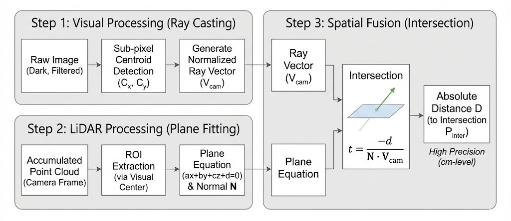

# LaserGuidance

<p align="center">
  
</p>


该工作是为 ROBOMASTER-2026 华北理工大学 Horizon 战队 飞镖制导中激光测距部分 以及 英雄机器人吊射基地激光测距部分 所做的第二代探索工作。

通过 Livox Mid-70 激光雷达与大恒工业相机搭配，实现基于 **射线–平面交点** 实现敌方基地引导灯的实时三维定位与测距。

整体流程： 视觉端通过阈值找到基地引导绿灯后生成相机射线，LiDAR 端拟合目标所在平面，最终求交得到雷达系下的坐标与距离，并可选通过自适应 3D 卡尔曼滤波稳定输出，同时输出质量指标、可视化 Marker 和实时距离波动曲线。



---
## 效果展示


<p align="center">
  
</p>

<p align="center">
  
</p>


- 可以看到通过 自适应卡尔曼滤波 以后整体测距还是比较稳的，**维持在 +-1 cm 左右** 甚至是毫米级波动（当然，这里在室内测试距离较短，可以测试验证 28m 时精度波动状况）

---
## 目录结构

```
laser-guidance/
├── src/laser_guidance/
│   ├── config/
│   │   ├── LidarCamera.yaml        # 相机内参+畸变，LiDAR→Camera 外参
│   │   └── params.yaml             # 运行参数模板，可直接编辑
│   ├── include/laser_guidance/
│   │   ├── camera_model.hpp        # 标定文件读取
│   │   ├── distance_plotter.hpp    # 实时距离曲线可视化
│   │   ├── image_processor.hpp     # HSV 检测 + 射线生成
│   │   ├── kalman_3d.hpp           # 自适应 3D 卡尔曼滤波
│   │   └── plane_fitter.hpp        # ROI 点云筛选 + RANSAC 平面
│   ├── src/
│   │   ├── camera_model.cpp
│   │   ├── distance_plotter.cpp
│   │   ├── image_processor.cpp
│   │   ├── kalman_3d.cpp
│   │   ├── plane_fitter.cpp
│   │   └── locator_node.cpp        # ROS2 主节点（点云累积、求交、发布）
│   └── CMakeLists.txt / package.xml
└── build/, install/, log/          # 由 colcon build 生成
```

---

## 构建与运行

环境要求

- Ubuntu 22.04

- ROS 2 Humble

- Livox Mid-70 驱动（发布 sensor_msgs/PointCloud2，通常为 /livox/lidar）

- 工业相机驱动（发布 sensor_msgs/Image）
---

1. 安装依赖：
   ```bash
   sudo apt install ros-humble-pcl-ros ros-humble-pcl-conversions
   ```
2. 构建 & 编译：
   ```bash
   source /opt/ros/humble/setup.bash
   
   mkdir -p ~/laser_ws/src && cd ~/laser_ws/src
   
   git clone https://github.com/BreCaspian/LaserGuidance.git
   
   cd ~/laser_ws && rosdep install --from-paths src --ignore-src -r -y
   
   colcon build --packages-select laser_guidance && source install/setup.bash
   ```
3. 运行（默认加载安装目录的参数/标定）：
   ```bash
   ros2 run laser_guidance locator_node --ros-args \
     --params-file install/laser_guidance/share/laser_guidance/config/params.yaml
   ```
   现场调参示例：`-p roi_radius_px:=400 -p min_depth_m:=2.0 -p max_depth_m:=12.0 -p plot_window_enabled:=false`。  
   如果要使用源码路径的 `params.yaml`，请同时覆盖 `-p calib_file:=/home/.../src/laser_guidance/config/LidarCamera.yaml`。

> 修改 YAML **不需要重新编译**，重新运行节点即可生效。

4. 运行示例

  ```bash
  [INFO] [1766479150.288065745] [laser_guidance]: >>> Target Localized! <<< Pos [6.716, -0.005, -0.200] m | Distance: 6.719 m
  [INFO] [1766479150.320516040] [laser_guidance]: >>> Target Localized! <<< Pos [6.716, -0.003, -0.197] m | Distance: 6.719 m
  [INFO] [1766479150.356939728] [laser_guidance]: >>> Target Localized! <<< Pos [6.717, -0.002, -0.195] m | Distance: 6.719 m
  [INFO] [1766479150.387875985] [laser_guidance]: >>> Target Localized! <<< Pos [6.715, -0.005, -0.202] m | Distance: 6.718 m
  [INFO] [1766479150.454713133] [laser_guidance]: >>> Target Localized! <<< Pos [6.715, -0.004, -0.199] m | Distance: 6.718 m
  [INFO] [1766479150.554453565] [laser_guidance]: >>> Target Localized! <<< Pos [6.716, -0.002, -0.195] m | Distance: 6.719 m
  [INFO] [1766479150.587345279] [laser_guidance]: >>> Target Localized! <<< Pos [6.717, -0.002, -0.194] m | Distance: 6.720 m
  [INFO] [1766479150.653704314] [laser_guidance]: >>> Target Localized! <<< Pos [6.717, -0.001, -0.192] m | Distance: 6.720 m
  [INFO] [1766479150.686944324] [laser_guidance]: >>> Target Localized! <<< Pos [6.717, -0.001, -0.191] m | Distance: 6.720 m
  [INFO] [1766479150.719691365] [laser_guidance]: >>> Target Localized! <<< Pos [6.715, -0.005, -0.201] m | Distance: 6.718 m
  [INFO] [1766479150.754757261] [laser_guidance]: >>> Target Localized! <<< Pos [6.716, -0.004, -0.199] m | Distance: 6.719 m
```
一切正常的情况下终端会产生如上输出，此时便可以打开 RVIZ2 接收相关调试话题进行调试优化。


---

## 主要参数（参考 `config/params.yaml`）

|            参数名             |     模块/作用域     |   类型    | 单位  |       作用说明       |           调参建议            |
| :---------------------------: | :-----------------: | :-------: | :---: | :------------------: | :---------------------------: |
|      `accumulate_time_s`      | 点云缓存/定位主节点 |   float   |   s   |   点云时间累积窗口   | 静止可增大(0.5–1.0)；运动减小 |
|         `image_topic`         |        输入         |  string   |   —   |     相机图像话题     |          与驱动一致           |
|         `lidar_topic`         |        输入         |  string   |   —   |     雷达点云话题     |   与驱动一致，注意 TF/frame   |
| `green_h` / `green_h_max` |      视觉检测       |   float   | HSV-H |       Hue 阈值       |           先宽后窄            |
| `green_s` / `green_s_max` |      视觉检测       |   float   | HSV-S |   Saturation 阈值    |      提高 S_min 可降误检      |
| `green_v` / `green_v_max` |      视觉检测       |   float   | HSV-V |      Value 阈值      |       固定曝光后再收紧        |
| `debug_roi_half_size_px` |     调试可视化      |    int    |  px   |   debug ROI 半径     |          仅影响显示           |
| `debug_roi_output_size_px` |     调试可视化      |    int    |  px   |   debug ROI 输出尺寸 |          仅影响显示           |
|         `min_depth_m`         |    点云 ROI 过滤    |   float   |   m   |       深度下限       |      略小于最小工作距离       |
|         `max_depth_m`         |    点云 ROI 过滤    |   float   |   m   |       深度上限       |      略大于最大工作距离       |
|        `roi_radius_px`        |    点云 ROI 过滤    | float/int |  px   |       ROI 半径       |   点稀→增大；误入背景→减小    |
|     `min_plane_normal_z`      |     平面合法性      |   float   |   —   |     法向 z 门限      |    太大易丢面；太小易混入     |
|    `min_normal_alignment`     |     平面连续性      |   float   |   —   | 与上一帧法向点积门限 |   抖动大→提高；丢面多→降低    |
|  `plane_distance_threshold`   |      平面拟合       |   float   |   m   |     内点距离阈值     |      常用 0.03–0.05 试起      |
|     `plot_window_enabled`      |    距离曲线/绘图    |   bool    |   —   |       启用绘图       |         仅调试建议开          |
|     `plot_history_size`        |    距离曲线/绘图    |    int    |  点   |       历史长度       |         趋势观察增大          |
|    `plot_smoothing_alpha`      |    距离曲线/滤波    |   float   |   —   |       平滑系数       |   抖动大→增大；响应慢→减小    |
|       `kalman_enabled`        |   3D 卡尔曼滤波     |   bool    |   —   |    启用滤波稳定输出  |      不需要时可关闭           |
|    `kalman_process_noise`     |   3D 卡尔曼滤波     |   float   |  m/s² |  过程噪声(加速度)    |        0.3–1.0 试起           |
| `kalman_initial_position_var` |   3D 卡尔曼滤波     |   float   |  m²   |   初始位置方差       |     与初始误差一致            |
| `kalman_initial_velocity_var` |   3D 卡尔曼滤波     |   float   | (m/s)²|   初始速度方差       |      可适当放大               |
|      `kalman_sigma_min`       |   3D 卡尔曼滤波     |   float   |   m   |   高质量测量噪声     |        0.02–0.05              |
|      `kalman_sigma_max`       |   3D 卡尔曼滤波     |   float   |   m   |   低质量测量噪声     |        0.15–0.30              |
| `kalman_quality_inliers_lo`   |   3D 卡尔曼滤波     |    int   |   点  |   内点低阈值         |        80–150                 |
| `kalman_quality_inliers_hi`   |   3D 卡尔曼滤波     |    int   |   点  |   内点高阈值         |       300–600                 |
|    `kalman_quality_cos_lo`    |   3D 卡尔曼滤波     |   float  |   —   |   退化几何阈值       |        0.2–0.3                |
|   `kalman_quality_alpha`      |   3D 卡尔曼滤波     |   float  |   —   |  质量 EMA 系数       |  越大越跟随，0.1–0.3          |
|        `kalman_gate_nis`      |   3D 卡尔曼滤波     |   float  |   —   |    NIS 门控阈值      |   7.815(95%)或11.345(99%)    |
|         `calib_file`          |    标定/模型加载    |  string   | path  |     标定文件路径     | 用 `share/<pkg>` 相对路径更稳 |

---

## 话题接口

| 话题 | 类型 | 说明 |
|:----:|:----:|:----:|
| `/debug_image` | `sensor_msgs/Image` | ROI 增强图，用于验证视觉检测 |
| `/guide_light/position` | `geometry_msgs/PointStamped` | 雷达系下交点（`frame_id=livox_frame`） |
| `/guide_light/distance` | `std_msgs/Float32` | **距离值（米）** |
| `/guide_light/plane_cos` | `std_msgs/Float32` | `|n·r|`，越大越可信 |
| `/guide_light/plane_inliers` | `std_msgs/UInt32` | RANSAC 内点数 |
| `/plane_marker` | `visualization_msgs/Marker` | 拟合平面，便于在 RViz 中对齐观察 |

---

## 调试建议

1. **确认话题与 TF**：`/livox/lidar`、`/image_raw` 都在发，静态 TF 提供 `livox_frame → camera_frame`。
2. **视觉调试**：观察 `/debug_image` 是否锁定绿灯，如有偏差调节 HSV/ROI。
3. **平面质量**：监控 `/guide_light/plane_cos` 与 `/guide_light/plane_inliers`；若频繁被过滤，检查 ROI 半径、深度范围是否覆盖目标。
4. **距离曲线**：窗口显示原始+平滑值，可快速判断稳定性。若不需要，`plot_window_enabled:=false`。
5. **点云密度**：时间充足的情况下建议尽量增加点云累计时间窗口 `accumulate_time_s` ，建议最少 0.7 秒。
6. **常见问题**：
   - “Waiting for point cloud”：话题名不匹配或 QoS 不兼容（Livox 默认 reliable，节点也是 reliable）。  
   - “Not enough points in ROI”：深度窗口或 ROI 过小，请根据实际距离调整 `min_depth_m/max_depth_m` 与 `roi_radius_px`。  
   - 平面不可见：在 RViz 中将 Fixed Frame 设为 `livox_frame`，并确保 `/plane_marker` 的 Alpha > 0。

---

## 扩展方向

- 尝试使用轻量化神经网络进行绿灯识别寻找。
- 平面估计可换用更复杂的优化 ，只需实现新的 Fitter 并挂到 `locator_node`。
- 可以增加更多调试话题以便在现场快速定位问题。
- 条件允许可以尝试 520nm 窄带滤光镜片，在光源复杂情况下可以有效增加成功率。
- 手动指定绿色光源后基于历史数据进行约束 ，适用于飞镖。
- 配合雷达站定位约束距离，适用于英雄机器人 (0x0301) 。

---

## 讨论


最初我的想法是直接利用 Mid-70 点云对引导灯区域取深度来测距。但在 20 m 以外，即使对点云进行 1–3 s 的时间积分，引导灯处仍常因回波稀疏、遮挡与角度不利导致有效点不足，距离估计不稳定。

后续一个偶然的想法催生了通过 射线–平面交点 获取距离的思路。

在视觉端只要能稳定检测到绿灯，就可得到相机射线方向。

那么雷达端便不再依赖灯本体点云，而是利用灯周围更密集的结构点拟合其所在承载面，并对平面法向施加朝向约束。最终在统一坐标系下求射线与平面的交点，从而获得引导灯的三维位置与距离。

但实验结果表明：基于 DBSCAN 的点云拟合并不总能恢复**引导灯所在的局部承载面**。原因在于引导灯并非安装在严格的小平面上，而是位于中部及两侧凸起的非规则表面，如下所示。

<p align="center">
  
  
</p>

该结构可用点少、几何不够平整，导致 DBSCAN 更容易选中面积更大、点更密且更平整的后方垂直墙面作为主平面。

由于该墙面恰好位于射线延长方向上，且其法向在当前约束下仍满足朝向相机的判定条件，最终会出现：射线穿过引导灯后与墙面求交，得到稳定但错误的距离与位置输出。

---

**这里本人给出的最终解决方法是在获取准确基地3D模型后对引导灯区域进行标记，然后直接转为 .pcd 模板，再将点云做 ROI 裁剪后通过 ICP 或者 GICP 自动配准模板，这就可以直接获得基地相对于激光雷达 6DoF 位姿，再据此把模型中已标定的引导灯点位变换到雷达坐标系直接输出距离。**
**当然也可以保留相机射线做几何一致性约束来抑制配准误差提高鲁棒性。**
**上述方案是第三代探索工作主要内容。**

**目前对该现有方案仍然持保守态度，有待进一步测试优化，但其思路可以扩展至其他应用场景**
